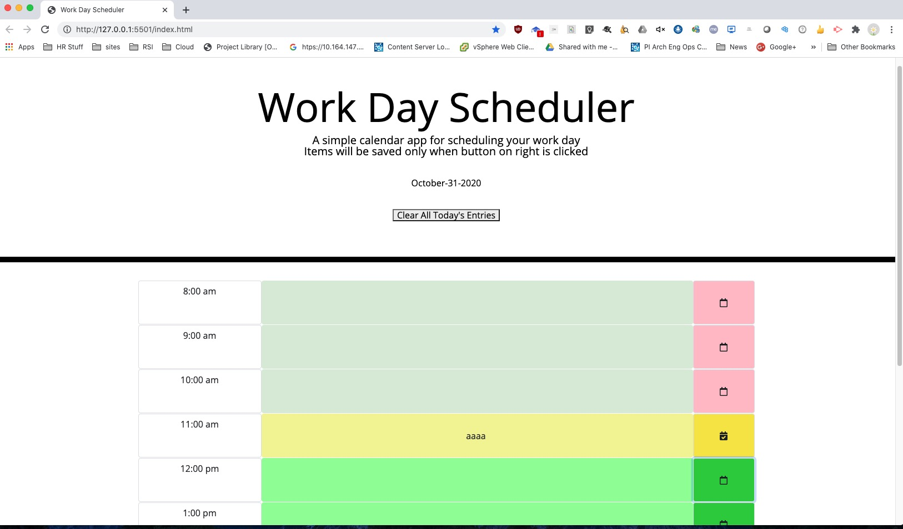

[My Project Application Link](url)
[My Project Application Repo on github.com](url)undefined
## Installation
The installation pocess is a download of git source, installing required npm modules by using npm install. The package.json file is included in the same directory as the application.

* a
* b
* c
* d

undefinedundefinedundefined