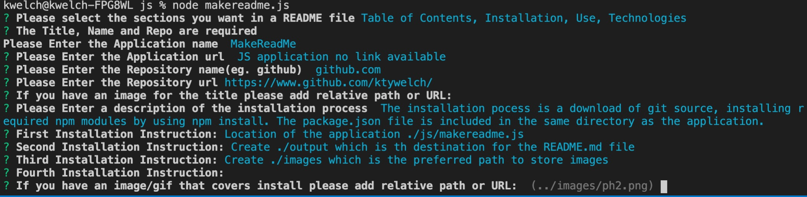

This application will generate a README.md file that contains the selected standard sections of a markdown file used in application development.

[Read Me Maker Application Link](In this case there is no url - this is a node based js )

[Read Me Maker application can be found on repository github.com](https://www.github.com/ktywelch/readmemaker)
## Table of contents
* [Title](#Title)
* [Installation](#Installation)
* [Usage](#Usage)
* [Technologies](#Technologies)
* [Contributions](#Contributions)
* [Test](#Test)
* [License](#License)
## Installation
The installation pocess is a download of git source, using npm install to install required modules based on the package.json file included in the same directory as the application.

* Once the application is downloaded from git, change to the ./js directory
* run "npm install" to install the required modules

## Usage
The user can use this applcation to generate a README.md file containing the sections selected. Once the file is created it can me opened and modified using any standard text editor.

* User changes directory to the ./js path 
* Executes the "node readmemaker.js" to start the program
* User selects the sections they want to have in the README.md file
* User is prompeld for questions and when completed file will be generated in ../output directory. User can edit the file or open in preview of web browser to see the formatted output.

## Technologies
This was developed using a variety of technologies and resources all are open source.

* VSCode - used to create and edit the application
* node.js - the js interpreter used to execute the stand alone js
* npm - node package manager used to install and track dependencies
* npm modules inquirer,utils and fs

## Contributions
Recognizing contributors and sites that helped in development:

* Lucah, Sam, Mike, Archana for attending study session and sharing ideas on approach
## Test
No testing is available at this time
## License
MIT